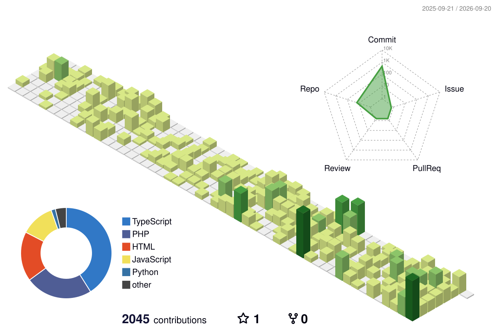

# Hi there, I'm Ageng Prayogo 👋

  

---

### 👨‍💻 About Me

* 🎓 **Pendidikan:** Mahasiswa Teknik Informatika (Information Technology) di **Institut Teknologi Sepuluk Nopember (ITS)** Surabaya.
* 💻 **Fokus Software:** Backend & Web Development (Laravel + Inertia.js / React, Golang Fiber).
* 🖥️ **Homelab & Infrastructure:** Pengembang server mandiri (Proxmox, CasaOS, Docker, Cloudflare Tunnels, MikroTik Networking).
* 📈 **Algorithmic Trading:** Mengembangkan bot trading & sistem *backtesting* kuantitatif (Freqtrade, FreqAI).
* 🐧 **OS Favorit:** Primary driver di **Ubuntu/Debian** Linux.

---

### 🛠️ Tech Stack & Ecosystem

#### **Languages & Frameworks**

#### **Infrastructure, Homelab & DevOps**

---

### 📊 GitHub Statistics

  
  

---

### 🏙️ My GitHub City (3D Contribution)

  

---

### 📫 Connect with Me

  
  

